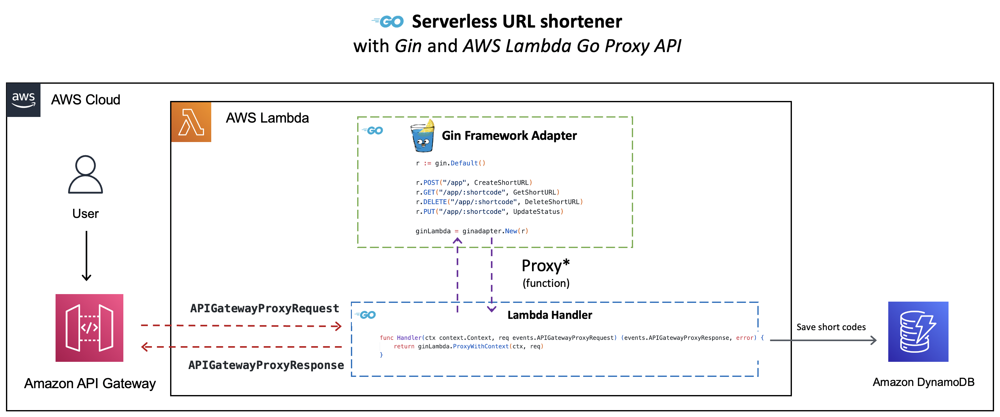

# Run a Golang Gin application as a Serverless AWS Lambda function

One of the previous blog posts ([Can I run existing Go applications on AWS Lambda?](https://community.aws/posts/golang-gin-app-on-aws-lambda)) introduced you to the [AWS Lambda Go API Proxy](https://github.com/awslabs/aws-lambda-go-api-proxy), and how it's framework/package specific adapter implementations (for `gorilla/mux`, `echo` and `net/http`) allow you to run existing Go applications as [AWS Lambda](https://docs.aws.amazon.com/lambda/latest/dg/welcome.html?sc_channel=el&sc_campaign=datamlwave&sc_content=golang-gin-app-on-aws-lambda&sc_geo=mult&sc_country=mult&sc_outcome=acq) functions fronted by [Amazon API Gateway](https://docs.aws.amazon.com/apigateway/latest/developerguide/welcome.html?sc_channel=el&sc_campaign=datamlwave&sc_content=golang-gin-app-on-aws-lambda&sc_geo=mult&sc_country=mult&sc_outcome=acq). 

The AWS Lambda Go API Proxy also supports the [Gin](https://github.com/gin-gonic/gin), which one of the most popular Go web frameworks! This blog post demonstrates how take an existing URL shortener service written using the `Gin` framework, and run it as a serverless AWS Lambda function. Instead of using AWS SAM, we will change things up a bit and use the [AWS CDK](https://docs.aws.amazon.com/cdk/v2/guide/home.html?sc_channel=el&sc_campaign=datamlwave&sc_content=golang-gin-app-on-aws-lambda&sc_geo=mult&sc_country=mult&sc_outcome=acq) to deploy the solution. AWS CDK is a framework that lets you define your cloud infrastructure as code in one of its supported programming and provision it through [AWS CloudFormation](https://aws.amazon.com/cloudformation/?sc_channel=el&sc_campaign=datamlwave&sc_content=golang-gin-app-on-aws-lambda&sc_geo=mult&sc_country=mult&sc_outcome=acq).

## Security

See [CONTRIBUTING](CONTRIBUTING.md#security-issue-notifications) for more information.

## License

This library is licensed under the MIT-0 License. See the LICENSE file.
